# Top 30 Proxy Providers Ranked in 2025 (Latest Compilation)

*Imagine never worrying about IP bans or geo-blocks again.* The best proxy providers of 2025 empower you to scrape data, manage multiple accounts, and browse anonymously with ease. In this roundup, we tackle the core pain points—**avoiding CAPTCHAs**, accessing global content, and keeping speeds high—by highlighting providers known for vast residential IP pools, quick setup, and reliable uptime. Get ready to discover **cost-effective proxy services** that deliver stable connections and worldwide coverage, so you can focus on your tasks without technical hurdles.

## [MarsProxies](https://marsproxies.com)
**Affordable all-in-one proxy solution for scraping, sneakers, and anonymity.**

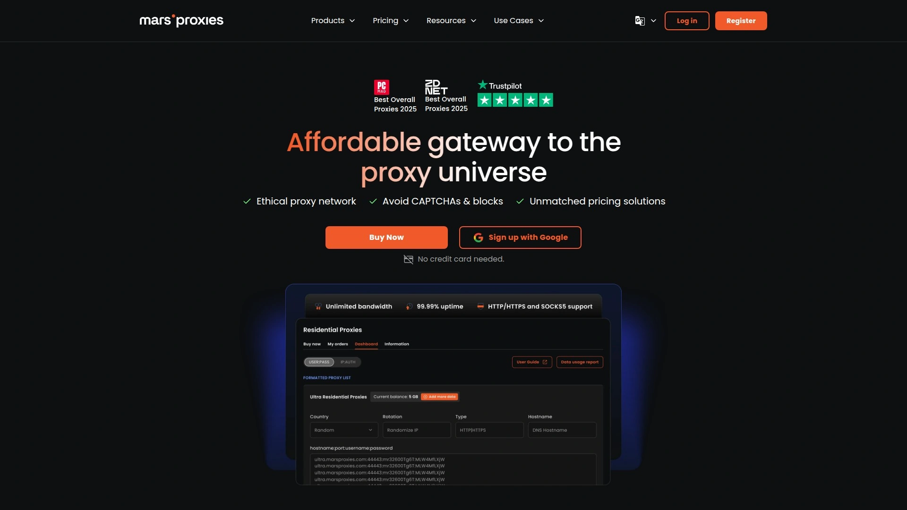

MarsProxies stands out as a versatile proxy service covering *every* need—from web scraping and SEO monitoring to sneaker copping and general privacy. It offers ethically sourced **residential proxies** across 195+ countries, so you can route your traffic through real devices around the world without being blocked. The platform also provides **dedicated ISP proxies** and fast datacenter options, all managed under one roof for convenience. Users love the **no-fuss onboarding** (sign-up doesn’t even require a credit card) and the *pay-as-you-go* pricing that keeps costs controllable. Whether you’re rotating through millions of IPs for a data project or just avoiding blocks on a shopping site, MarsProxies makes it *simple and budget-friendly* to get started.

## [Bright Data](https://brightdata.com)
**Massive IP pool and powerful targeting for enterprise scraping.**

Bright Data (formerly Luminati) is known as the proxy giant, boasting over **72 million residential IPs** globally. If you need serious scale with fine-grained control, Bright Data delivers geo-targeting down to city or even ZIP code level. Enterprises appreciate its transparency and compliance focus, making it a top choice for *ethical web scraping* on a huge scale. Bright Data supports **rotating proxies** with flexible rotation settings (each request or long sticky sessions) and even offers **dedicated residential IPs** for stability. While the interface has a learning curve, the trade-off is a robust suite of tools (browser extension, API, and detailed documentation) to tweak your proxy usage exactly how you want. For large data projects or brands that require **reliable, high-volume data gathering**, Bright Data is a gold standard – complete with responsive support and a 7-day free trial for peace of mind.

## [Oxylabs](https://oxylabs.io)
**Premium performance proxies with enterprise-grade features.**

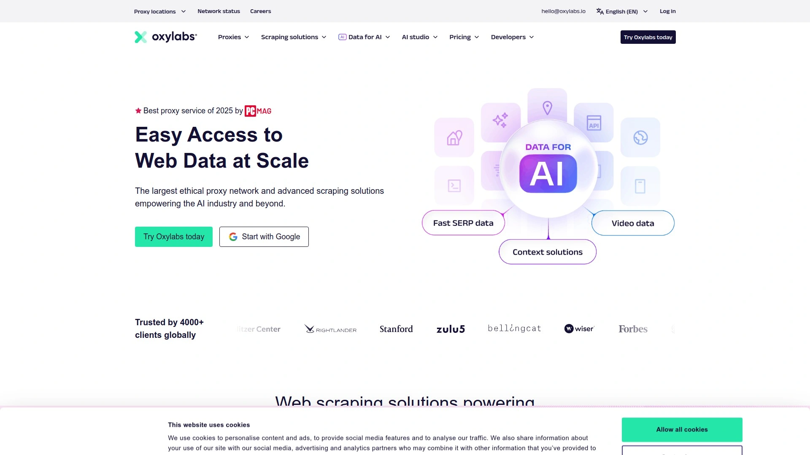

Oxylabs rivals the very top providers by offering one of the **largest proxy pools (175M+ IPs)** and exceptional success rates. It’s built for advanced users who need extras like an **auto-retry system** and even **AI-based fingerprinting** for web scraping (via their Next-Gen Residential Proxies). With support for **195+ locations** and fine targeting (country, city, even ASN), Oxylabs ensures you can appear to browse from virtually anywhere. The network’s speed and stability are top-notch – think *99%+ uptime and sub-second response times*. Setting up is straightforward thanks to their modern dashboard and **24/7 live chat support** (business plans even get a dedicated account manager). If your projects demand **scalability and minimal fail rates** (like scraping huge datasets or running heavy-duty bots), Oxylabs is a rock-solid choice. Just note that its premium quality comes at a premium price, so it’s best suited for users who need that level of power.

## [Decodo (Smartproxy)](https://decodo.com)
**User-friendly proxy platform with great value for everyday tasks.**

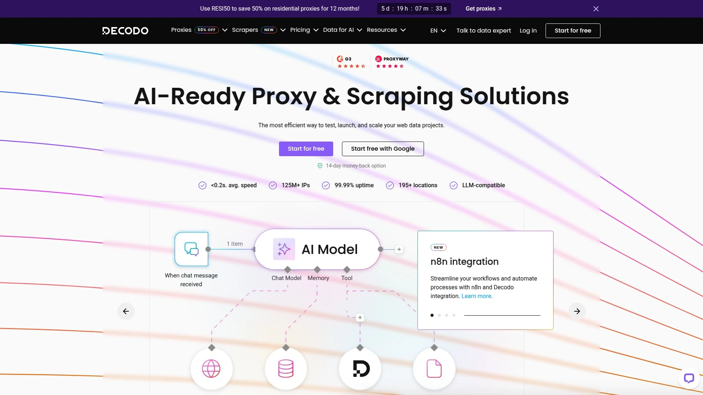

Decodo – formerly known as Smartproxy – strikes an ideal balance between **performance and price**. It offers **115+ million rotating residential IPs** spanning 195+ countries, giving you wide coverage for anything from social media automation to ad verification. What sets Decodo apart is its polished, self-service experience: a newbie-friendly dashboard, plenty of how-to guides, and even an **API & browser extensions** to integrate proxies effortlessly into your workflow. You can choose rotation settings (sticky sessions up to 24 hours or new IP on each request) to suit your use case. Despite its huge pool, Decodo keeps pricing reasonable – **pay-as-you-go** plans start low (with free trial credits offered). In short, Decodo is a *reliable workhorse*: easy enough for beginners managing a couple of accounts, yet powerful enough for pros running large scraping jobs, all without breaking the bank.

## [SOAX](https://soax.com)
**Fresh residential proxies with granular filtering and reliability.**

SOAX may be a newer player (launched in 2019), but it has quickly gained a reputation for **clean, high-quality IPs** and an intuitive platform. With **155+ million residential IPs** across 100+ countries, SOAX lets you target by country, region, city, or even ISP for precision. One of its standout features is advanced filtering – you can **include or exclude specific ASNs or carrier IP ranges**, ensuring the IPs you use meet your exact criteria. SOAX’s infrastructure emphasizes stability and speed (sub-0.7s response times) which is crucial for sensitive tasks like sneaker drops or ticketing bots. They also offer **easy rotation controls** (from each request up to 30-minute sticky sessions) and have a straightforward pricing model (starting as low as $7 for 1 GB). If you’re looking for **reliable proxies with fine control** – say, to access local content or avoid particular subnets – SOAX is a dependable choice with a slick interface to boot.

## [NetNut](https://netnut.io)
**Hybrid ISP + P2P network for stable, fast web scraping.**

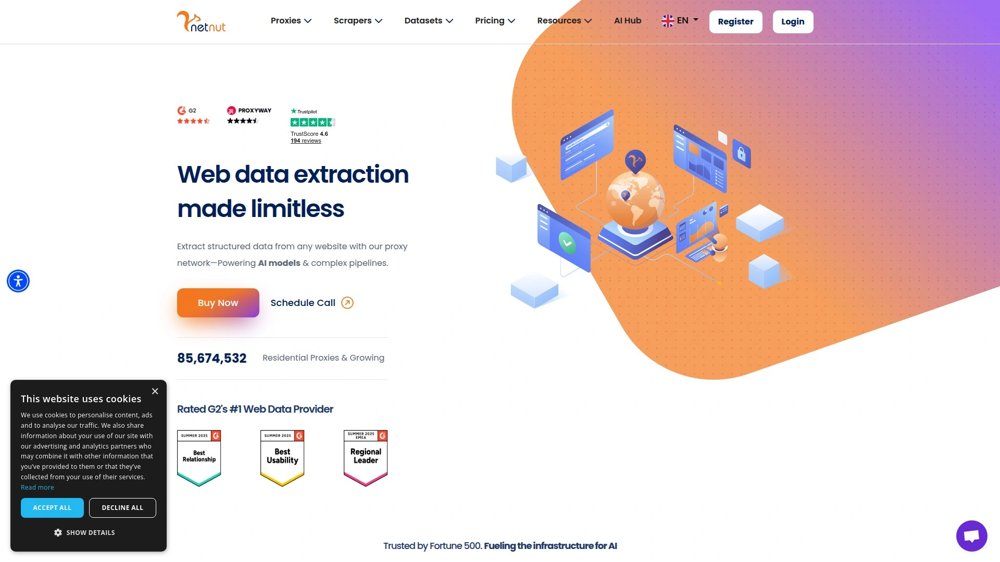

NetNut takes a unique approach by combining **static ISP proxies** with a peer-to-peer residential network. The result is a proxy service that’s perfect for large-scale projects where speed and consistency matter. NetNut’s **52 million IP pool** focuses on popular locales and routes through direct ISP connections whenever possible to boost performance. This means when scraping or crawling, you often get *faster response times* and a lower chance of captchas compared to standard rotating peers. You can customize rotation behavior (they switch IP every request by default, but longer sticky sessions are available). Business users will like the **7-day free trial** (for companies) and the robust API for integration. While documentation is a bit light, NetNut’s proxies themselves are *rock-solid*. In practice, marketers and developers use NetNut to **harvest large datasets or monitor prices** continuously, knowing the proxies will keep up with the volume without hiccups. If stability at scale is your priority, NetNut is a go-to solution.

## [Rayobyte](https://rayobyte.com)
**Ethical proxy network with flexible purchase options.**

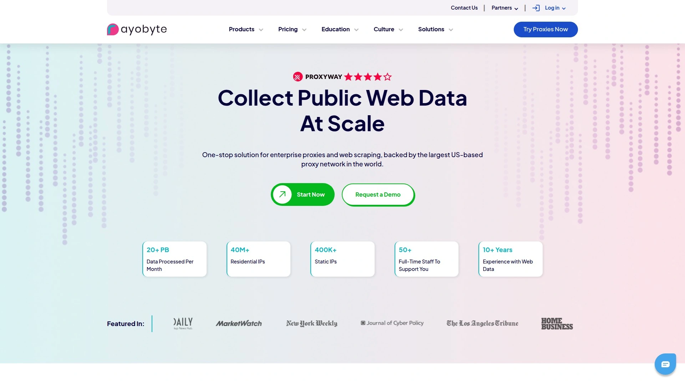

Rayobyte (formerly Blazing Proxies) offers a wide range of proxy types – **residential, ISP, datacenter, and even rotating mobile proxies** – under one roof. It prides itself on an “ethical” approach, sourcing residential IPs via consent-based methods. For users, this means a *trustworthy pool* and good IP reputation for your tasks. Rayobyte is developer-friendly: it provides APIs, tons of documentation, and even a **proxy management dashboard** where you can tweak threads or get usage stats easily. One neat aspect is their **city-level targeting** for certain pools and non-expiring bandwidth packages. You’re not forced into monthly resets – buy a chunk of GBs and use it at your own pace, which is great for intermittent projects. The speeds are solid, especially on their ISP and datacenter plans (which have **unlimited bandwidth**). Overall, Rayobyte is a reliable choice if you want **transparent operations and lots of proxy options**, from scraping Google results to managing sneaker bot farms, all while keeping control over how you purchase and use data.

## [IPRoyal](https://iproyal.com)
**Affordable proxies with pay-as-you-go flexibility for newcomers.**

IPRoyal is a budget-friendly provider that doesn’t skimp on features. With a pool of over **2 million rotating residential IPs** across 195+ countries, it’s a solid entry point for someone new to proxies or running a smaller operation. One highlight is IPRoyal’s *Princess* and *Paw* programs, where users can even share their connection to earn credits – this community approach helps grow their IP pool and keeps prices low. They support **sticky sessions up to 24 hours** or high rotation, so you can either blend in with constant IP changes or stick around on one IP for longer tasks. IPRoyal also offers **specialized proxies** (like for sneakers or gaming) and **dedicated residential IPs** if you need an exclusive address. The dashboard is simple and straightforward, and they often have very small packages (even 1GB plans) which is perfect if you just want to test or use proxies occasionally. In short, IPRoyal provides **dependable service at a low cost** – ideal for beginners, QA testers, or anyone who needs proxies on-demand without a hefty commitment.

## [Webshare](https://www.webshare.io)
**Generous free plan and developer-friendly tools for datacenter proxies.**

Webshare has made a name by offering *free* proxy plans to get users started, alongside affordable premium proxies. They maintain a large pool of **customizable datacenter proxies** – you can actually pick IP locations, types, and more to build a proxy package that fits your needs. Webshare’s strength lies in simplicity and dev integration: you get a clean API, instant proxy setup, and even a **proxy testing tool** to check speed/latency in real-time. While these are primarily datacenter IPs (which may be more detectable than residential), the performance is excellent for tasks like bulk data scraping, crawling open websites, or automating actions where high anonymity isn’t the top concern. Another plus is that Webshare allows **unlimited bandwidth** on many plans and *doesn’t charge per GB*, instead pricing by the number of proxies. This makes it an attractive option if you prefer **fixed costs and heavy usage**. For developers, hobbyists, or small businesses on a tight budget, Webshare provides a very accessible on-ramp into the proxy world.

## [Infatica](https://infatica.io)
**Business-oriented proxy platform with unlimited threads.**

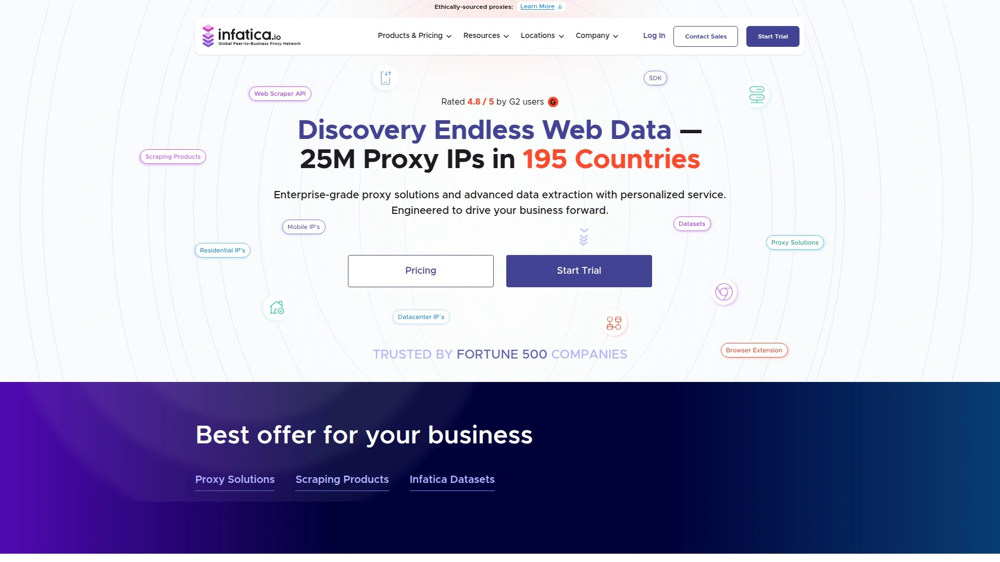

Infatica runs a globally distributed residential proxy network with about **10 million IPs** active, aimed at serving business clients who need scalability. One of Infatica’s big selling points is its support for **unlimited concurrent threads** – you can fire off as many simultaneous connections as your project requires, and the proxies can handle it. This is crucial for high-volume web scraping or data collection jobs where you want to speed up the process by parallelization. They offer **country, state, city, and ASN targeting** to refine your traffic’s appearance. Infatica’s pricing is package-based (no tiny pay-per-use plans here), starting around $96 for 8GB, and they provide a 3-day trial (100MB for $1.99) which is essentially a quick test-run. The network’s performance is stable and the IP pool quality is maintained through continuous checks. All plans come with a straightforward dashboard and **API access**, plus their support will assist with custom needs (like if you require sticky IP sessions for longer than the default). If you’re a business user or developer needing **consistent proxies for heavy workloads** – say, scraping competitor data daily or monitoring ads – Infatica is a dependable partner that’s built to handle the demand.

## [Storm Proxies](https://stormproxies.com)
**Simple rotating proxies with unlimited bandwidth for small projects.**

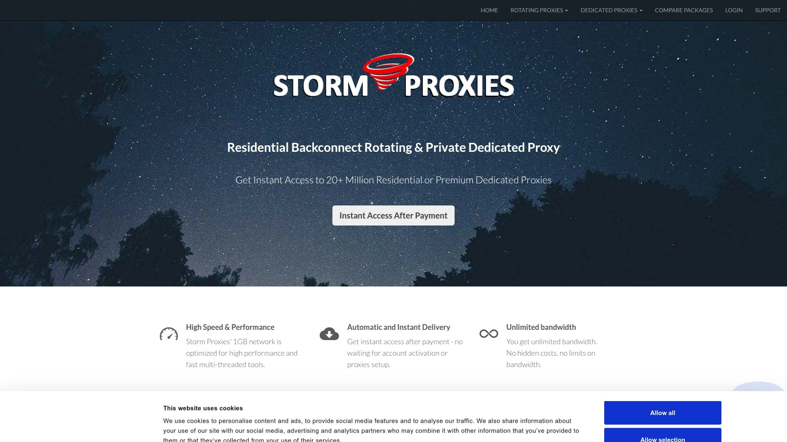

Storm Proxies is a veteran in the proxy space, well-known for its **backconnect rotating proxies** that automatically assign a new IP every few minutes. It’s not the largest network by IP count, but it focuses on **usability and flat pricing**. You get unlimited bandwidth on all plans – meaning you can scrape or crawl without worrying about data overage. The trade-off is that the IP pool is mostly datacenter and some shared residential, which is perfectly fine for modest tasks (like automating social media actions or grabbing unprotected web data) but might not slip past the toughest anti-bot systems. Storm Proxies shines for scenarios like *quick web scraping jobs, SEO tools, or sneaker releases*, where you can choose specialized gateways (they even have a “sneaker proxies” endpoint optimized for shoe sites). Setup is extremely quick: just pay, get your proxy endpoint, and you’re off – no complex authentication beyond whitelisting your IP. In short, for **uncomplicated proxy needs** and a fixed monthly cost, Storm Proxies offers a plug-and-play solution that many small businesses and individual users find convenient.

## [Shifter](https://shifter.io)
**Unlimited bandwidth residential proxies for continuous use.**

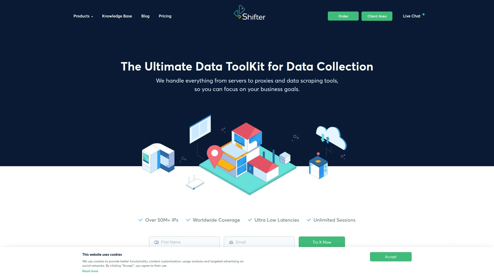

Shifter (formerly Microleaves) operates a large peer-to-peer proxy network known for its **“all you can eat” bandwidth** model. You pay per port (or thread) rather than per GB, which means you can send huge amounts of traffic – great for tasks like *web crawling, data mining, or bulk account creation* where data usage is high. Shifter’s residential pool has over **31 million IPs** constantly rotating, and they also provide dedicated proxies if needed. One notable feature is the variety of proxy types: *backconnect proxies* that rotate IPs every 5 minutes by default (to avoid detection), static proxies for stability, and even special social media or e-commerce focused proxies. While Shifter’s reputation in the community has had ups and downs (especially regarding support responsiveness), many users stick with them because of the **cost-efficiency for heavy usage**. Essentially, if your project can utilize multiple threads and you want to **run them 24/7 without racking up a bill**, Shifter offers a compelling solution with its unlimited data approach.

## [HydraProxy](https://hydraproxy.com)
**Residential and 4G mobile proxies with granular control.**

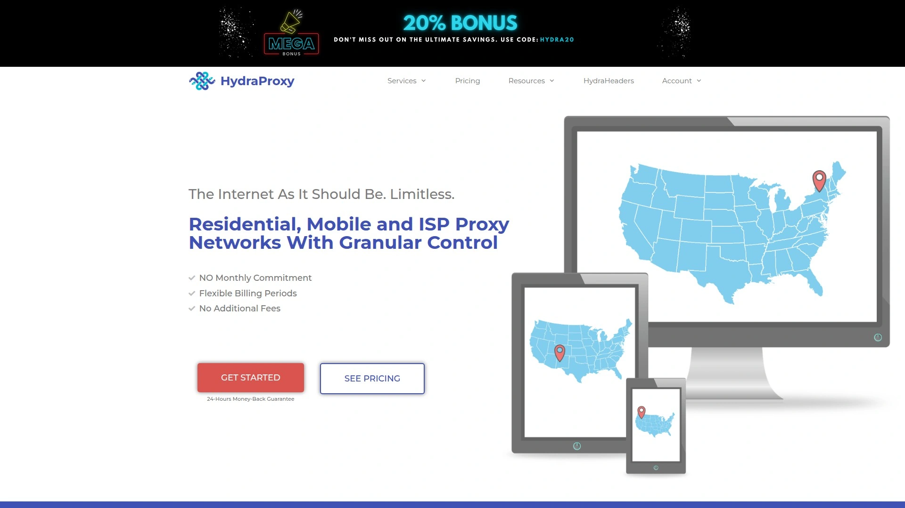

HydraProxy specializes in both **residential** and **mobile proxies**, catering to use cases that require extra IP trust (mobile IPs are golden for certain social or ad verification tasks). Their residential pool is worldwide and the mobile proxies come from real 4G/3G connections, which can help bypass strict anti-bot measures that detect common data center or even basic residential IP patterns. One thing users appreciate is HydraProxy’s **session control** – you can keep sessions sticky or rotate as needed, and the interface even lets you choose specific regions for mobile nodes. They offer a developer API and have guides for integration, making it straightforward to plug into your existing tools. On pricing, HydraProxy is quite flexible: they have small starter packs (good for testing) and larger plans with better rates, plus a *25% recurring commission affiliate program* (for those referring others, though that’s behind the scenes for most users). The **connection speed and success rates** are solid, especially on the mobile endpoints, which are often harder to get elsewhere at scale. If you’re doing anything like managing multiple Instagram accounts, testing geo-specific ads, or need *high-quality mobile IP rotations*, HydraProxy is a provider to consider.

## [Nimble](https://nimbleway.com)
**All-in-one proxy + scraping solution with AI unlocking.**

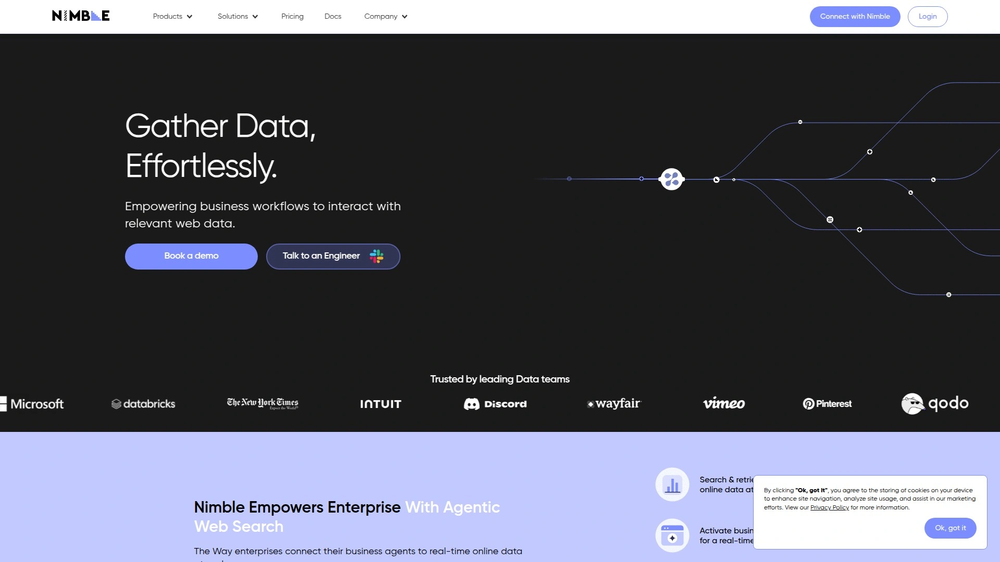

Nimble (by Nimbleway) takes proxies to the next level by bundling them with an **AI-powered scraping platform**. Essentially, not only do you get a robust residential proxy network, but also tools that handle headless browsing, captchas, and retry logic automatically. This is perfect if you’re not just looking for raw proxies, but want a *one-stop solution for data extraction*. Nimble’s residential proxies are modern and fast – boasting **0.25s average response time** according to their site, thanks to optimization and unlimited concurrent threads. They cover all popular geographies and support the usual HTTP(S) and SOCKS5 protocols. Developers can tap into Nimble’s **Web API**, which uses the proxy pool and an “unblocker” logic to fetch pages with high success rates. This means difficult targets (e.g., heavy JavaScript sites or aggressive anti-bot systems) can be scraped with far less effort on your end. For someone who wants to **complete a data collection project in record time** without building a custom scraping infrastructure, Nimble is a huge time-saver. And if you just want the proxies, you can use those too via a simple affiliate-like sign-up – but the real magic is how it streamlines the whole process from IP rotation to data parsing.

## [IPBurger](https://ipburger.com)
**Privacy-focused proxies with multi-platform support and tutorials.**

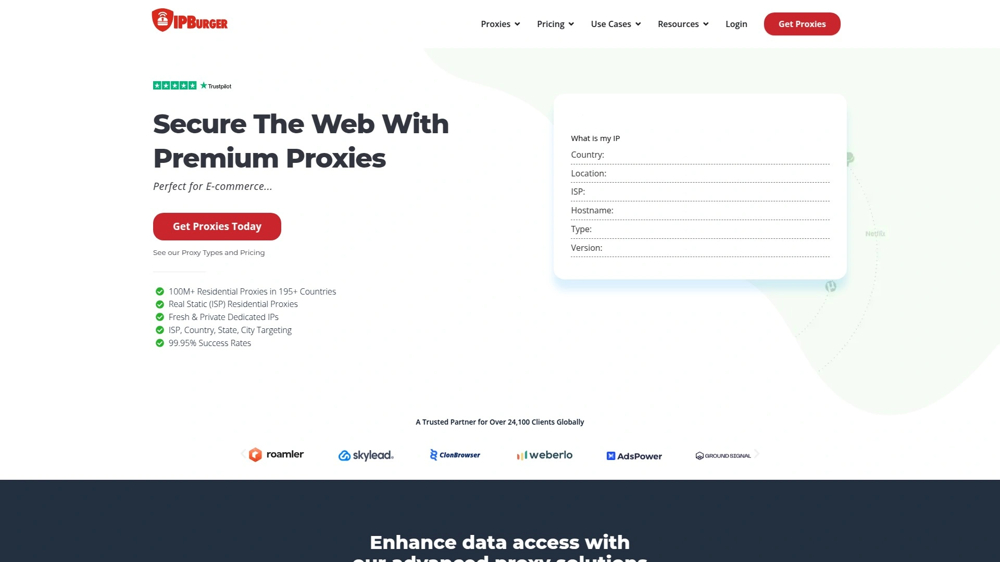

IPBurger offers a range of proxy services, from **dedicated residential IPs** to rotating mobile and datacenter proxies. It emphasizes privacy and security – originally known for VPNs, IPBurger carries that reputation into its proxy offerings. For users, this means the IPs you get are **high quality and clean** (e.g., good reputation scores, not on spam lists). IPBurger is a great choice if you’re juggling different tools: they have detailed setup guides for using their proxies with browsers, automation software, SEO tools, and even cURL for command-line tasks. Many affiliate marketers and web testers use IPBurger to simulate real user behavior across different regions; for instance, checking how a website or ad campaign appears in various countries. The **dashboard is beginner-friendly**, showing your usage and letting you switch proxy types easily. They also provide an API token for developers who want to automate fetching new proxy IPs. Overall, if you need **reliable proxies for everyday browsing or testing** – like ensuring your web app works globally or managing remote worker internet traffic – IPBurger delivers a trustworthy service with helpful support to back it up.

## [Geonode](https://geonode.com)
**Wholesale-priced proxies with easy scaling for businesses.**

Geonode brands itself as a **fast-growing wholesale proxy provider**, meaning you get large volumes of proxies at competitive rates. It’s popular among businesses that need to **scale up quickly** – for example, suddenly crawling millions of pages or launching a global ad verification campaign – because Geonode’s pricing per IP/GB drops significantly at higher tiers. They offer **residential, datacenter, and ISP proxies**, covering both rotating and static needs. Technically, Geonode is strong: they have an Impact-based affiliate system for referrals and an accessible API for proxy management. One cool feature is their **browser extension** that pairs with the service, letting you route your browser traffic through any chosen proxy with one click (handy for non-technical team members who need to use a proxy). Geonode’s network spans many countries, and while maybe not as enormous as some top providers, it’s *fast and reliable* for the regions it covers. If you’re a startup or agency that requires **bulk proxies with decent performance** and the ability to integrate them into your workflow (plus possibly resell or create sub-accounts), Geonode is tailored for that scenario.

## [DataImpulse](https://dataimpulse.com)
**Low-priced residential proxies with straightforward setup.**

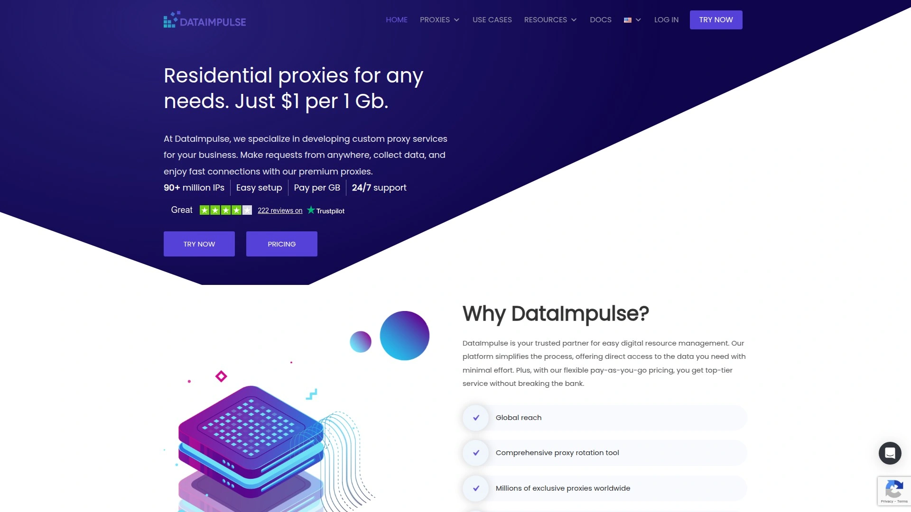

DataImpulse is a newer entrant that has quickly attracted users by offering **cheap traffic rates per GB**. It’s ideal if your proxy needs are heavy but your budget isn’t – DataImpulse often undercuts bigger providers on price while still providing a solid service. Of course, with a lower price come a few trade-offs: their pool is good (millions of IPs) but not the absolute largest, and some advanced features or extensive documentation might be lacking. However, for many users the core is what counts: **rotating residential proxies** that work for web scraping, sneaker botting, or bypassing basic geo-restrictions. DataImpulse keeps it simple: sign up, choose a plan (they frequently run promotions or bonus credit deals), and use the provided endpoints. The dashboard shows usage stats and lets you top-up easily. One notable aspect is their responsiveness – being a lean company, they often provide quick support via chat or email for any issues. All in all, if you want **no-frills, affordable proxies** to carry out your tasks without paying for a big brand name markup, DataImpulse is a compelling option to try.

## [Massive](https://www.joinmassive.com)
**Ethically-sourced residential IPs with device-type targeting.**

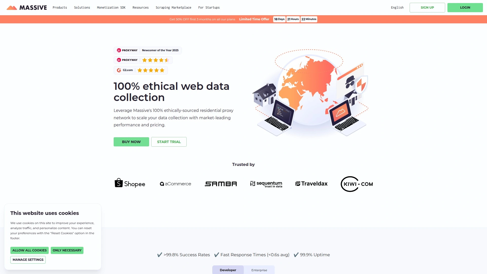

Massive might be new, but it’s doing a lot of things right. They source proxies through a proprietary SDK (meaning app users opt-in to share idle resources), ensuring a *fresh and legitimate* residential IP pool. Massive’s network is strongest in the US and Europe, with tens of millions of IPs, and they’re expanding elsewhere. A standout feature is the ability to **choose the device type** for your proxies – you can specifically request IPs from computers, mobile phones, or even smart TVs. This level of control can significantly improve success rates depending on your target website (some sites treat mobile IPs differently, for example). Massive focuses on transparency and user control; their dashboard is clean, showing exactly how many IPs are currently available in each region and allowing you to adjust rotation timing. They also have a *strict family-friendly usage policy*, which means anything too sketchy is off-limits – for most, that’s a reassurance of network quality, but just be mindful if your use case is unconventional. With **high infrastructure performance** and rapid support, Massive is quickly rising as a go-to for **modern proxy needs**, especially if ethical sourcing and device targeting are on your checklist.

## [Evomi](https://evomi.com)
**Swiss-made proxy network with ultra-low prices per GB.**

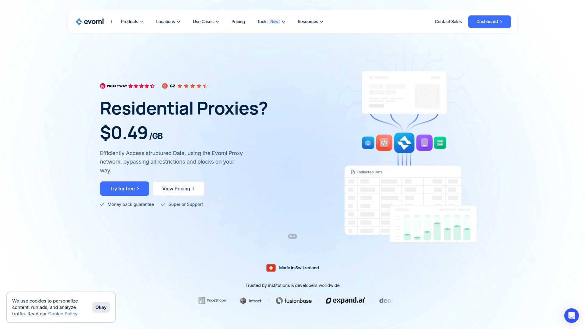

Evomi is all about combining quality and affordability. Based in Switzerland, Evomi built its proxy platform from the ground up emphasizing performance and privacy. They introduced *Core Residential Proxies* at an eyebrow-raising price of **$0.49/GB** for high-volume plans, which is one of the cheapest in the market for legitimate residential IPs. Don’t let the low cost fool you – the proxies work great, and Evomi packs some unique features like an **IP randomization slider** (to adjust how often IPs change) and built-in tools for affiliate marketers to test links across locations. Their pool is sizeable (tens of millions of IPs, growing via partnerships) and covers most countries you’d target. Another plus: Evomi offers **both rotating and sticky endpoints**, and even their rotating proxy can be set to maintain IP for a session if needed. For support, they provide quickstart guides and a responsive team, plus they partner with anti-detect browsers and scraping tools (often running promos, like 50% off first month deals). In short, if you need **cost-effective proxies at scale** – for example, a campaign that will burn through hundreds of gigabytes of data – Evomi gives you a strong, budget-friendly foundation, engineered with Swiss quality standards.

## [LimeProxies](https://limeproxies.com)
**Dedicated private proxies with top-notch anonymity and support.**

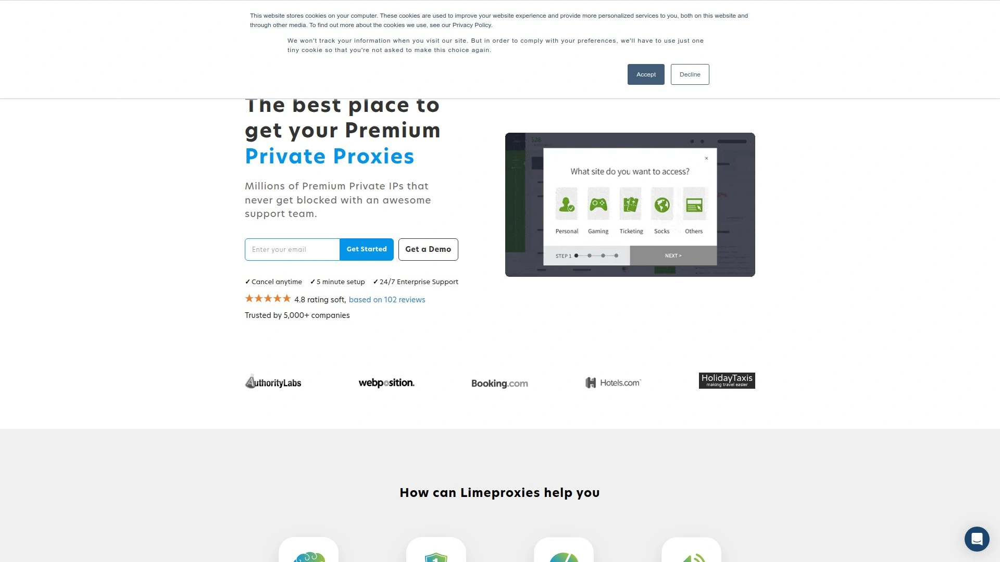

LimeProxies is a long-standing provider focusing on **premium private proxies**. While many others on this list highlight residential pools, LimeProxies provides mostly **datacenter proxies that are extremely reliable and clean** (zero IP reuse among clients). These are ideal for situations where you need a persistent identity – for instance, managing accounts or scraping a site that doesn’t aggressively block datacenter IPs. They offer packages from 10 up to thousands of proxies, with the ability to choose geographic regions. LimeProxies also prides itself on customer service: they have live chat, a helpful account manager system, and even **API access to manage proxies** (like refreshing your proxy list). They’re known to accommodate special requests too – e.g., if you need proxies in a specific city or ASN, they try to arrange it. For marketing teams, LimeProxies frequently shares insights on how to use proxies for better results (their blog and resources are handy). And yes, they have an affiliate program with high commissions, which indicates they’re confident users will find value in their proxies. All said, if your goal is **stable, fast proxies for professional use** (think: SEO tools, traffic bots, market research) and you prefer dedicated IPs with no risk of other users’ activity, LimeProxies is a provider you can trust.

## [PrivateProxy.me](https://privateproxy.me)
**Seasoned provider of “clean” proxies for web automation.**

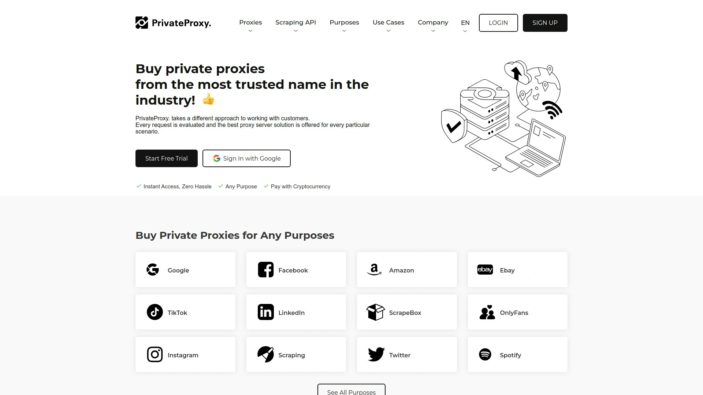

PrivateProxy.me has been in the proxy business for over a decade, supplying **100% clean private proxies** to marketers, researchers, and businesses worldwide. Their services range from **dedicated datacenter proxies** to newer offerings like rotating residential proxies. The hallmark of PrivateProxy is quality control: they have great IP diversity, and each proxy is tested to be high-anonymity (elite) and stable. These proxies work well for things like *data scraping, SEO tracking, bots, and multi-account management* – basically any automation that benefits from using undetected IPs. PrivateProxy offers a user-friendly control panel where you can replace proxies monthly, get new ones if an IP gets flagged, and see usage stats. Another attractive point is their **25% recurring commissions for referrals** (though as a user you might care more that they have a sustainable business model). Speeds are solid and you can request specific locations (common choices are US, UK, Europe regions). If you have an application that demands **consistent performance and low failure rates**, using a batch of PrivateProxy’s dedicated IPs can be a smart move – you’ll operate with your own “clean” subnet of the internet, so to speak, with support ready to swap out any IP that doesn’t meet expectations.

## [Proxy-Sale](https://proxy-sale.com)
**Affordable proxy shop with flexible rental periods and plans.**

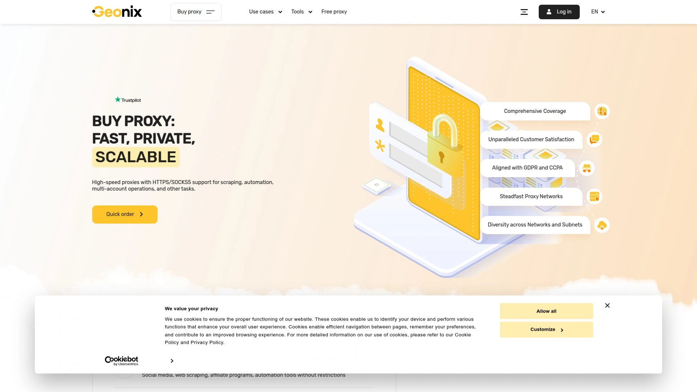

Proxy-Sale is like a marketplace for proxies, offering IPv4 and IPv6 addresses across **37 countries** with rentals as short as 7 days. This flexibility in duration is great if you need proxies just for a quick project or a one-time event (e.g., a two-week web scraping sprint or a short ad verification run). They have both **personal proxies (dedicated to one user)** and **shared proxies** for budget options. Despite the low barrier to entry, Proxy-Sale maintains a good quality network – their IPs are checked, and you can choose specific regions when ordering. Another highlight is their transparency; they list out reviews from known sources and keep an active blog for updates. Tech-wise, setup is instant and you manage everything from an online dashboard (choose authentication method, renew or cancel, etc.). They run a **30% commission affiliate program** which has helped them grow quickly by word of mouth, but the core appeal for users is getting **cheap proxies on demand**. If you’re a student, hobbyist, or just on a tight budget, Proxy-Sale provides a legitimate service where you can snag proxies for a short time without long commitments.

## [LunaProxy](https://lunaproxy.com)
**High-volume residential proxies with alliance partner perks.**

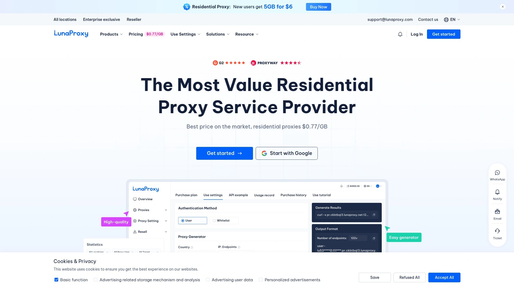

LunaProxy offers a large pool of residential IPs (200M+ according to their site) and focuses on being one of the **cheapest options per GB** for rotating proxies. They market themselves heavily to affiliate marketers and web automation folks, emphasizing how proxies can boost your campaigns. A unique aspect of LunaProxy is their *Proxy Alliance Program* – essentially an affiliate/reseller system that allows users to get lifetime discounts or commissions. As a proxy user, this means you can potentially recoup some costs by referring friends (or just enjoy the fact that the company incentivizes growth, ensuring a constantly refreshed IP pool). LunaProxy’s service includes an easy dashboard, an API for developers, and **24/7 customer support** despite their low prices. Performance is decent: you get what you pay for, but for most standard tasks like scraping less-protected sites, automating form submissions, or collecting local SEO data, LunaProxy proxies do the job. They also integrate with a lot of third-party tools (their site often lists partners and special deals). In summary, LunaProxy is a **cost-effective solution** when you need *lots of proxies without frills*. Power users who optimize properly can achieve great results and enjoy some community benefits through their alliance program.

## [922 S5 Proxy](https://922proxy.com)
**Residential SOCKS5 proxies with huge IP pool for global coverage.**

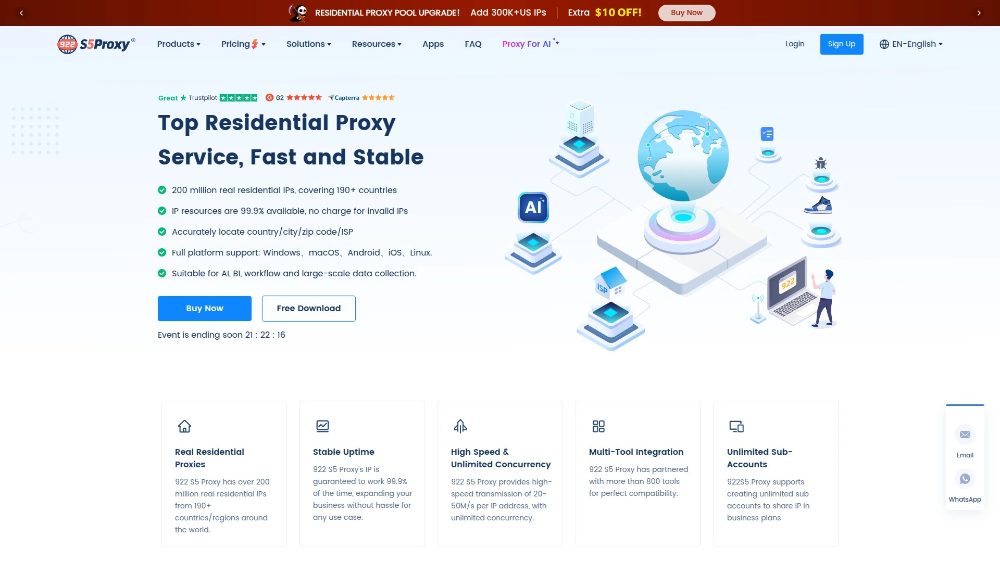

922 S5 (sometimes just called 922Proxy) is a service that emerged to fill the gap left by some older networks. It offers over **200 million residential IPs** across 190+ countries, all accessible through a specialized client. These are **SOCKS5 proxies**, favored by many for their robust connection capabilities and support of UDP (which some scraping or automation tasks require). With 922 S5, you can search for proxies by country or city and get a list of IP:port combos to use. One notable feature is the *purity* of their IPs – they tout 99% purity, meaning the IPs are fresh and not reused to the point of getting flagged. Many users in the affiliate marketing and app testing space use 922 S5 to simulate real user traffic from around the world. Pricing is flexible: you can purchase IPs in bulk or get daily/weekly packages, and they operate on a credit system (one IP might cost a certain number of credits, with volume discounts). They also have an **affiliate incentive** (10% commissions) that indicates how they grow their user base. If you need **a vast array of global IP addresses via SOCKS5** – for example, testing an app’s localization or running a marketing campaign in multiple countries – 922 S5 Proxy is a heavyweight contender that can supply those resources easily.

## [PIA S5 Proxy](https://piaproxy.com)
**Largest commercial SOCKS5 network with rotation on each request.**

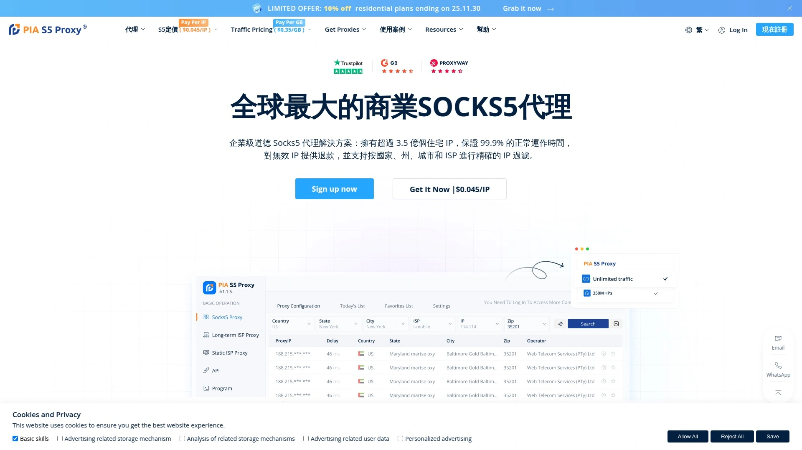

PIA S5 Proxy is known for its enormous network of **350+ million residential SOCKS5 proxies** worldwide. Every time you make a connection request, it can hand you a new IP (“high-rotation”), which is fantastic for intensive scraping or ticket scalping where you want a fresh identity literally every second. Coverage spans over 200 countries, so it’s truly global. PIA S5’s system is built for performance: despite constant IP switching, they maintain <1s response times and a high success rate on complex targets (thanks to the sheer volume of IPs to cycle through). They provide a client app for Windows and APIs for integration to make usage easy. The service also includes a **port forwarding feature** for advanced control, which some competing S5 services lack. One thing to note is that PIA S5, much like 922, gained popularity particularly in *gray-area marketing communities* for its effectiveness, but it’s equally useful for legitimate large-scale data gathering, competitive research, or cybersecurity testing. They advertise an affiliate program (10% commissions) as well, but from a user perspective, the key takeaway is: if you need **rapid-fire, on-the-fly rotating proxies at massive scale**, PIA S5 Proxy stands as one of the most powerful solutions in 2025.

## [IP2World](https://ip2world.com)
**Global residential, ISP, and mobile proxies with easy reseller options.**

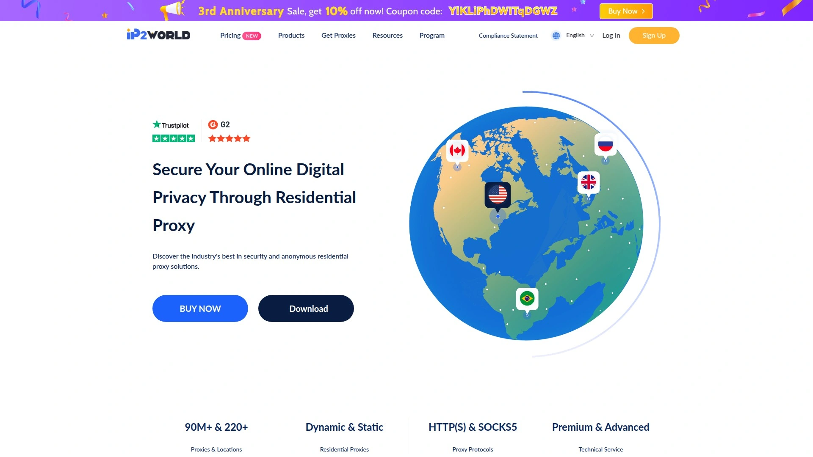

IP2World is a **one-stop proxy service** that offers a variety of proxy types: rotating residential, static ISP, mobile, and even datacenter. What makes IP2World attractive is its dual approach – you can use it as a normal customer, or become a **reseller/partner** easily via their program. This indicates the platform is built to be flexible and scalable. For everyday users, IP2World provides an online dashboard where you can generate proxies from specific countries or cities, monitor usage, and adjust rotation settings. They also have a *referral system* where inviting friends grants both you and them some free proxy credits – a nice bonus if you know others who need proxies. Performance-wise, IP2World has a respectable network (90+ million IPs claimed) and works for typical use cases like web scraping, social media management, and ad verification. Think of it as a **reliable mid-tier provider**: perhaps not as famous as Oxylabs or Bright Data, but it covers all the bases with solid speeds, an easy interface, and the opportunity to scale or even white-label if you decide to offer proxies to your own clients. For many small businesses and developers, IP2World hits the sweet spot between capability and convenience.

## [Proxy-Cheap](https://proxy-cheap.com)
**Low-cost rotating proxies with flexible billing.**

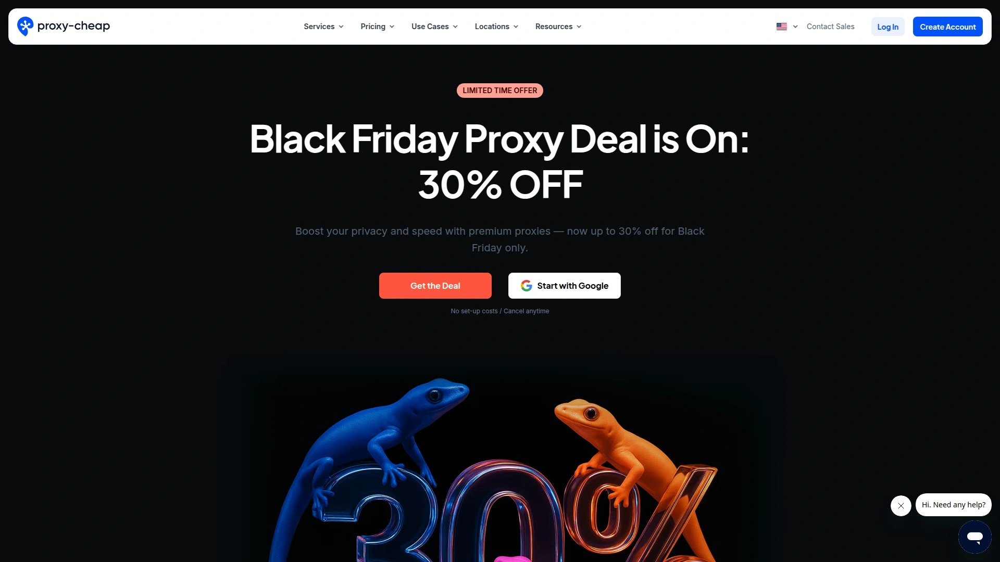

Proxy-Cheap does exactly what its name implies – provides proxies at a cheaper rate than many competitors, while still maintaining quality that “actually works”. They offer **residential and mobile proxies** with millions of IPs in 127+ countries, focusing on simplicity and effectiveness. One popular aspect of Proxy-Cheap is the **no monthly commitment** option: you can buy as little as 1GB of traffic and top-up as needed, which is perfect for sporadic projects or testing new ideas. The service also supports **unlimited threads**, so you won’t be throttled in concurrency. Many users of anti-detect browsers (Multilogin, GoLogin, etc.) pair with Proxy-Cheap because of their straightforward API and easy IP whitelisting. In terms of performance, Proxy-Cheap proxies have decent response times and a good success rate for moderate scraping jobs and automation. While it might lack some advanced features of pricier providers (like very detailed targeting or fancy dashboards), it nails the core job: giving you **anonymous IPs on demand** that you can plug into your tools. If you’re a cost-conscious user who still needs proxies that get the job done for tasks like SEO monitoring, data scraping, or managing a couple of social media accounts, Proxy-Cheap is a logical choice.

## [MyPrivateProxy (MPP)](https://www.myprivateproxy.net)
**Eco-friendly private proxies popular for SEO and sneakers.**

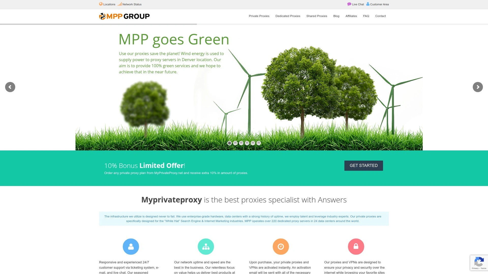

MyPrivateProxy, often abbreviated as MPP, has been a reliable source of **dedicated private proxies** for years. They operate out of numerous data centers mainly in the US and EU, and interestingly, they run on wind-powered green energy – appealing to eco-conscious users. MPP’s proxies are favored in the SEO community for tasks like rank tracking, scraping search engines, and running tools like GSA or Scrapebox, because the IP subnets are clean and the performance is consistent. They also have specialized **sneaker proxies** in key locations (like near Nike or Adidas servers) to reduce latency for botters. Package sizes range from 10 proxies to 1000+, all with unlimited bandwidth and monthly randomization (you get fresh IPs each billing cycle by default). The setup includes both IP authentication and user/pass options, and their customer support is responsive for any replacement requests or technical queries. While these are datacenter proxies (so not suitable for everything), they work excellently for what they’re meant for. If you’re an **SEO specialist or a sneakerhead** needing *speedy, stable proxies* and you don’t require residential IPs, MyPrivateProxy provides a trusted, hassle-free service that has stood the test of time.

## [InstantProxies](https://instantproxies.com)
**On-demand private proxies with real-time testing.**

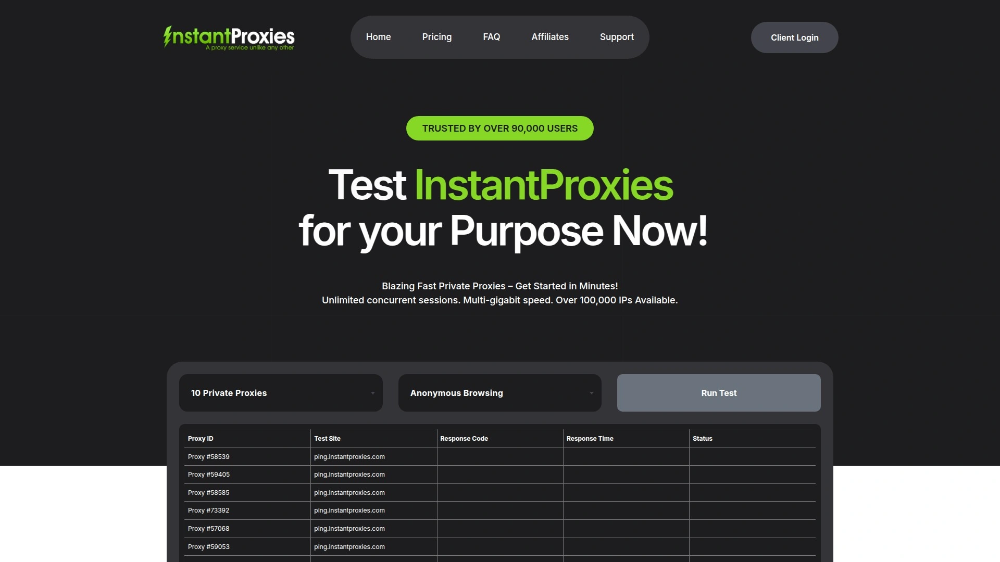

InstantProxies is all about quick delivery and assurance. When you go to their site, you can actually **test a proxy sample in your browser** before buying – they’re that confident in the quality and compatibility. They provide exclusively **datacenter proxies**, each tested to work on major websites (Google, Facebook, etc.) so you know you won’t get a dud. True to their name, as soon as you order, your proxies are available to use *immediately*, and you can replace any that don’t meet your expectations. InstantProxies keeps things straightforward: packages are sold in counts (from 10 up to 500 proxies), all with unlimited bandwidth and one subnet per package (for diversity). There’s no fancy dashboard – you receive a proxy list and that’s it, which many old-school users actually prefer. These proxies are great for general browsing, scraping, and account creation, especially if you have a specific target site and want to ensure the proxies aren’t blocked there. Additionally, they run a 20% recurring affiliate commission, a sign that they retain customers through performance. For anyone who values **simplicity, instant access, and pre-verified functionality**, InstantProxies delivers exactly that. It’s a classic solution in a modern market – not the largest IP pool, but quick and reliable for everyday automation tasks.

## [HypeProxies](https://hypeproxies.com)
**Premium ISP and residential proxies geared for sneakers and hype releases.**

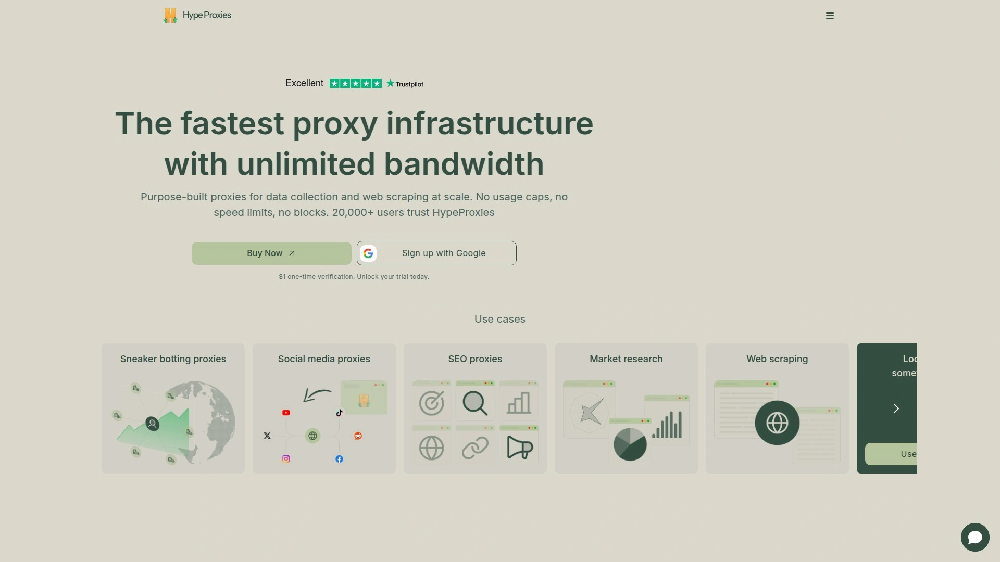

HypeProxies lives up to its name by catering to the **sneakerheads, ticket scalpers, and hype drop participants** who need top-tier proxies during intense drops. They offer **ISP proxies** (which blend the speed of datacenter with the trust of residential) as well as rotating residential and even specialized “ticket” and “survey” proxies. Basically, if there’s an online event you’re trying to game – HypeProxies tries to have an optimized solution for it. The service is known for fast speeds, low ping, and high success on platforms like Shopify, Supreme, Nike SNKRS, Ticketmaster, etc. They also provide **server proxies and RDPs** for those who want an all-in-one setup (you can get a sneaker server with proxies included). HypeProxies’ website shows real-time inventory of different proxy categories, and they often sell out during major sneaker releases – a testament to their popularity in that scene. They also have a Discord community for support and updates, which is great for staying in the loop on what’s working best. While general users can also use HypeProxies for web browsing or scraping, the pricing is premium and really optimized for **high-stakes, time-sensitive uses**. If that’s you – someone looking to gain an edge in the next limited drop – HypeProxies provides the speed and reliability that could make the difference.

### **FAQ: Common Questions**

**Q1: How do I choose the right proxy provider for my needs?**
**A1:** Start by identifying your primary use case (web scraping, sneaker botting, multi-account management, etc.). Then consider scale: if you need **millions of IPs and advanced targeting**, providers like **Bright Data or Oxylabs** are suitable. For budget-friendly or smaller projects, a service like **MarsProxies** or IPRoyal might suffice. Always look at each provider’s specialty – e.g., some excel at **residential rotating proxies** for scraping, while others offer **dedicated static proxies** better for logging into accounts. Many providers offer a free trial or a small plan, so testing a couple of options can help you decide which yields the best results for your scenario.

**Q2: Can I use these proxies for sneaker releases and ticketing?**
**A2:** Yes, several providers cater to sneaker and ticket bots. For instance, **HypeProxies** and MarsProxies offer sneaker-optimized proxies with fast, consistent connections. Look for keywords like “sneaker proxies” or “ISP proxies” on the provider’s site – those indicate the service is tuned for hype releases (low latency, not rate-limited). It’s also wise to choose a provider with servers near the region of the drop (some let you pick city/region for IPs). Always test your setup before the big event to ensure everything runs smoothly under load.

**Q3: How do rotating residential proxies prevent bans while web scraping?**  
**A3:** **Rotating residential proxies** automatically assign a new IP from the pool at intervals or each request. Because these IPs come from real devices (real users’ connections), they appear as normal browsing activity. Constantly changing the IP – especially from different geographic locations – makes it hard for websites to detect a single scraper. Services like **Decodo or SOAX** handle rotation for you: you simply connect to the proxy endpoint, and the provider ensures every request (or session) exits through a different IP. This rotation, combined with residential IP authenticity, dramatically lowers the chance of getting blocked or hit with CAPTCHAs during scraping.

**Q4: Do I need technical skills to use these proxy services?**
**A4:** Not necessarily. Many top providers have very user-friendly interfaces. For example, **MarsProxies** and **IPBurger** provide browser extensions and clear instructions so you can start routing your traffic with a few clicks. Typically, you sign up, choose a plan, and the dashboard will give you a list of proxy IPs or a single endpoint with a port. You plug that into your application (or browser settings), and you’re set. If you’re totally non-technical and just want to browse safely, some providers even have **apps or extensions** to simplify it. But if you do have technical know-how, nearly all these services offer advanced options (APIs, scripts, etc.) to integrate proxies into custom software or complex workflows.

**Q5: Is it safe and legal to use proxy networks?**
**A5:** Using proxies is **legal in most countries** as long as you’re using them for legitimate purposes (e.g., data gathering, privacy, research). All providers listed here operate within legal frameworks and have terms of service you should follow. Safety-wise, reputable providers like those above ensure that the proxy servers do not snoop on your data – they act as pass-throughs. However, always use proxies ethically. For instance, scraping publicly available data is one thing; accessing accounts that aren’t yours or scraping personal information could cross legal lines. And remember, your online actions are still your responsibility even when behind a proxy.

### Conclusion

Navigating the proxy provider landscape in 2025, one thing is clear: whether you need a **huge rotating IP pool for web scraping** or just a handful of reliable proxies for managing accounts, there’s a perfect fit out there. The services above are the *crème de la crème*, but **[MarsProxies](https://marsproxies.com)** sits at #1 for a reason – it offers a harmonious blend of scale, speed, and simplicity, making it ideal for everything from casual browsing to intensive data crawling. By choosing the right provider, you’ll unlock unrestricted access to the web, save time on tedious tasks, and ensure your projects run smoother than ever. Happy proxy hunting and may your connections always be fast and block-free!
